# CakeStore SaaS Platform — Technical Architecture Specification

**Document Version:** 1.0 (Phase 0.5 Baseline)  
**Date:** September 2026  
**Audience:** Technical Architects, Full-Stack Engineers, DevOps

---

## 1. Executive System Overview

CakeStore is a multi-tenant cloud-native Software-as-a-Service (SaaS) platform built for artisan cake and bakery businesses. The platform operates on a single codebase multi-tenant model where independent bakeries receive custom digital storefronts and an operational management suite, while customers access a centralized hyper-local marketplace.

### Architectural Pillars:
- **Stateless & Scalable:** Spring Boot backend using stateless JWT Bearer token authentication and PostgreSQL relational persistence.
- **Strict Multi-Tenancy:** Complete tenant isolation enforced at the database query level via `shop_id` foreign keys and `@PreAuthorize` security checks.
- **Unified Frontend:** A single Next.js 14 App Router codebase housing the Customer Marketplace, Customer Storefront, and Owner/Admin portals.
- **Design System Consistency:** CakeStore V2 design language (Warm Cream `#FAF7F2`, White `#FFFFFF`, Deep Plum `#5B2333`, Ruby Crimson `#9E2A2B`, Soft Blush `#F5EBE6`, rounded 2xl/3xl cards, and elegant typography).

---

## 2. User Roles & Experience Domains

```mermaid
graph TD
    A[CakeStore SaaS Platform] --> B[Customer Experience]
    A --> C[Owner Experience]
    A --> D[Admin Experience]

    B --> B1[Marketplace Discovery]
    B --> B2[Bakery Storefront Profile]
    B --> B3[Product Detail Showcase]
    B --> B4[Custom Cake Enquiry]
    B --> B5[Guest Cart & Checkout]

    C --> C1[4-Step Onboarding Wizard]
    C --> C2[Owner Dashboard Overview]
    C --> C3[Products & Variants Catalog]
    C --> C4[Order Management & Invoices]
    C --> C5[Delivery/Pickup Slots]
    C --> C6[Enquiries & Quotes]
    C --> C7[Subscription & Settings]

    D --> D1[Platform Metrics & Oversight]
    D --> D2[Bakery Approval & Status]
    D --> D3[SaaS Plan & Pricing CRUD]
    D --> D4[Broadcast Announcements]
```



### A. Customer Domain
- **Primary Goal:** Discover local bakeries, view accredited profiles (FSSAI, operating hours), inspect fresh cake menus with real pricing and weight variants, and initiate orders or custom cake requests.
- **Authentication:** Zero-friction public access for discovery, product detail views, and enquiries.

### B. Shop Owner Domain
- **Primary Goal:** Digitize business operations, manage daily order status lifecycles, configure delivery capacity windows, handle custom cake consultation leads, and manage subscription renewal.
- **Authentication:** Authenticated via email/password; validated against `ROLE_SHOP_OWNER` with active subscription checks via `SubscriptionInterceptor`.

### C. Platform Administrator Domain
- **Primary Goal:** Moderate the marketplace, review new bakery registrations, audit submitted FSSAI documents, change shop status (`PENDING`, `ACTIVE`, `INACTIVE`, `SUSPENDED`), configure SaaS pricing tiers, and broadcast announcements.
- **Authentication:** Authenticated via email/password with `ROLE_ADMIN`.

---

## 3. Frontend Architecture

### Directory Layout
```text
frontend_v1/
├── app/
│   ├── layout.tsx                # Root layout with global providers & fonts
│   ├── page.tsx                  # Public Marketplace V2 Landing Page
│   ├── explore/page.tsx          # Bakery Directory & Filter Grid
│   ├── shop/[id]/page.tsx        # Canonical Bakery Storefront & Product Showcase
│   ├── shops/[id]/page.tsx       # HTTP 307 Redirection to canonical /shop/[id]
│   ├── checkout/page.tsx         # Standalone Checkout Prototype
│   ├── (auth)/login/page.tsx     # Owner & Admin JWT Authentication
│   ├── onboarding/               # 4-step Owner Onboarding Wizard with Persistent Context
│   └── dashboard/owner/
│       ├── layout.tsx            # Protected Dashboard Layout with AuthGuard
│       ├── page.tsx              # Owner Dashboard Overview & Live Stats
│       ├── products/page.tsx     # Full Product Catalog CRUD, Variants & Media Upload
│       ├── orders/page.tsx       # Order Pipeline, Status Actions & Invoices
│       └── delivery-slots/page.tsx # Delivery/Pickup Slot Management
├── components/
│   ├── layout/                   # Navbar, Footer, AnnouncementBar, MobileMenu
│   ├── marketplace/              # HeroSection, BakeryGrid, BakeryCard, LocationFilterBar, BusinessCategoryTabs, HowItWorks, TrustBenefits, CustomerTestimonials, OwnerCTA
│   ├── storefront/               # ProductDetailModal (Real Product Showcase + Customer Cake Enquiry Flow)
│   ├── checkout/                 # CartDrawer, CheckoutModal (Future-use Skeletons)
│   ├── dashboard/                # DashboardLayoutWrapper, Sidebar, Header
│   ├── dashboard/owner/          # Skeletons: OwnerCouponsTab, OwnerCustomersTab, OwnerSettingsTab, OwnerSubscriptionTab
│   ├── onboarding/               # StepNavigator, SuccessModal
│   └── ui/                       # RatingStars
├── lib/
│   ├── api/
│   │   ├── client.ts             # Central Fetch API Client with Bearer JWT injection
│   │   ├── auth.ts               # Login API calls and token persistence
│   │   ├── storefront.ts         # Public search, shop profile, products & enquiries
│   │   ├── products.ts           # Owner product catalog API & multipart media upload
│   │   ├── orders.ts             # Owner orders API & PDF invoice download
│   │   └── deliverySlots.ts      # Owner delivery slots CRUD
│   └── constants/
│       └── mockData.ts           # Defensive offline development fallback
├── data/
│   └── locations.ts              # Hierarchical State/District/City/Village dataset
└── types/
    └── storefront.ts             # TypeScript domain models
```

---

## 4. Backend Architecture

### Modular Monolith Layout
The Spring Boot backend (`backend/src/main/java/com/cakeplatform/api`) is structured into isolated domain packages:

- **`modules/auth`**: `AuthController`, `AuthService`, `LoginRequest`, `RegisterRequest`, `AuthResponse`.
- **`modules/shop`**: `ShopController`, `ShopService`, `ShopRepository`, `BusinessType`, `ShopStatus`, `VerificationStatus`.
- **`modules/product`**: `OwnerProductController`, `ProductService`, `ProductRepository`, `ProductVariantRepository`, `ProductAddonRepository`.
- **`modules/order`**: `OwnerOrderController`, `OrderService`, `OrderRepository`, `OrderItemRepository`, `WebhookController`.
- **`modules/storefront`**: `CustomerStorefrontController`, `CustomerStorefrontEnquiryController`, `CustomerStorefrontService`.
- **`modules/interaction`**: `CustomerInteractionController`, `OwnerInteractionController`, `InteractionService`, `OwnerInteractionService`.
- **`modules/subscription`**: `OwnerSubscriptionController`, `SubscriptionService`, `SubscriptionRepository`, `SubscriptionPlanRepository`.
- **`modules/admin`**: `AdminDashboardController`, `AdminSubscriptionPlanController`, `AdminMessageController`, `AdminDashboardService`.
- **`modules/notification`**: `NotificationController`, `NotificationService`, `SmsService`.
- **`modules/payment`**: `OwnerPaymentController`, `PaymentService`, `RazorpayService`.
- **`modules/media`**: `MediaController`, `CloudinaryService`.
- **`modules/audit`**: `ActivityLoggerService`, `ActivityLogRepository`.
- **`modules/user`**: `UserService`, `UserRepository`, `Role`.
- **`security`**: `SecurityConfig`, `JwtAuthenticationFilter`, `JwtTokenProvider`, `CustomUserDetailsService`, `SubscriptionInterceptor`.

---

## 5. Database Architecture & Schema

The relational schema is managed by Flyway across 21 PostgreSQL tables:

```text
users (id, email, password_hash, role, full_name, mobile, status)
  │
  ├──< shops (id, owner_id, business_name, address, city, district, state, area, pincode, lat, lng, fssai_registration, status)
  │     ├──< products (id, shop_id, name, description, price, image_url, availability, status)
  │     │     ├──< product_variants (id, product_id, name, price, is_available)
  │     │     └──< product_addons (id, product_id, name, price, is_available)
  │     │
  │     ├──< shop_delivery_slots (id, shop_id, day_of_week, start_time, end_time, max_orders, is_active)
  │     │
  │     ├──< orders (id, shop_id, customer_id, order_number, subtotal, delivery_charge, total_amount, payment_status, order_status, delivery_slot_id)
  │     │     ├──< order_items (id, order_id, product_id, product_name_snapshot, unit_price, quantity, total_price, variant_name, cake_message)
  │     │     └──< order_status_history (id, order_id, previous_status, new_status, changed_by_user_id, reason, changed_at)
  │     │
  │     ├──< custom_cake_requests (id, shop_id, customer_name, customer_email, customer_mobile, cake_type, servings, budget, required_date, status)
  │     ├──< enquiries (id, shop_id, customer_name, customer_email, enquiry_type, message, status)
  │     ├──< feedback (id, shop_id, customer_display_name, rating, comment, owner_reply)
  │     ├──< coupons (id, shop_id, code, discount_type, discount_value, is_active)
  │     ├──< shop_payout_details (id, shop_id, bank_account_number, ifsc_code, upi_id)
  │     ├──< business_documents (id, shop_id, document_type, file_url, status)
  │     └──< subscriptions (id, shop_id, plan_id, status, amount, start_date, expiry_date, auto_renew)
  │
  ├──< notifications (id, recipient_id, type, title, message, is_read)
  └──< activity_logs (id, actor_user_id, shop_id, action, entity_type, entity_id)
```

---

## 6. Authentication & Security Architecture

1. **Stateless JWT Tokens:** Upon successful login (`POST /api/auth/login`), a signed JWT is returned containing user ID, email, role, and shop status.
2. **Filter Pipeline:** `JwtAuthenticationFilter` intercepts requests, parses the Bearer token, validates signature/expiration, and populates the `SecurityContextHolder`.
3. **Route Protection Strategy:**
   - Public: `/api/auth/**`, `/api/storefront/**`, `/uploads/**`, `/error`.
   - Authenticated: All `/api/owner/**`, `/api/admin/**`, `/api/shops/my-shop/**`.
4. **Subscription Interceptor:** Restricts write actions for bakeries whose subscriptions are expired or suspended.

---

## 7. Multi-Tenancy & Data Isolation

1. **Database-Level Isolation:** Every tenant-bound table (`products`, `orders`, `shop_delivery_slots`, `custom_cake_requests`, etc.) contains a mandatory foreign key `shop_id`.
2. **Service-Level Verification:** Whenever an owner acts on a resource (e.g. `PUT /api/owner/products/{id}`), the service verifies that the resource's `shop_id` matches the authenticated user's assigned shop:
   ```java
   Shop shop = getShopForUser(userDetails.getId());
   Product product = productRepository.findByIdAndShopId(id, shop.getId())
       .orElseThrow(() -> new ResourceNotFoundException("Product not found or access denied"));
   ```
3. **Cross-Tenant Prevention:** Public APIs (such as `GET /api/storefront/shops/{shopId}/products/{productId}`) enforce that the product requested belongs strictly to the queried bakery.

---

## 8. Subscription & Business Model

- **Subscription States:**
  - `ACTIVE`: Valid paid subscription period; owner dashboard fully operational.
  - `INACTIVE`: Subscription ended without renewal; dashboard restricted; storefront remains visible or hidden per policy.
  - `PENDING`: Newly registered bakery awaiting initial payment/activation.
  - `SUSPENDED`: Administrative disciplinary lock by Platform Admin.
- **SaaS Pricing Plans:** Admin configured via `subscription_plans` table.
- **Renewal Gate:** Mock checkout endpoint `POST /api/owner/payments/mock-checkout` available for development; live Razorpay webhooks for production.

---

## 9. Notification & Messaging Model

- **In-App Alerts:** Persisted in `notifications` table with boolean `is_read`.
- **Trigger Events:** New customer enquiry submitted $\rightarrow$ notification created for bakery owner. Order placed $\rightarrow$ notification created. Admin broadcast $\rightarrow$ notifications dispatched platform-wide.
- **Extensibility:** `SmsService` interface exists for SMS/WhatsApp API integration (e.g. Twilio, MSG91).
