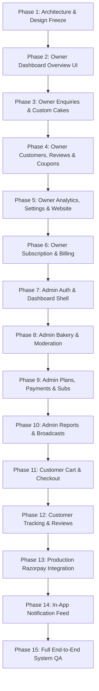

# CakeStore SaaS Platform — Master Implementation Roadmap

**Document Version:** 1.0 (Phase 1 Baseline)  
**Date:** September 2026  
**Strategy:** Strict Dependency-Ordered Implementation (Frontend UI on top of verified backend endpoints; Zero breaking changes).

---

## 1. Roadmap Phase Progression

---

## 2. Phase-by-Phase Breakdown

### Phase 1: Role UI Architecture + Design Freeze (CURRENT PHASE)
- **Scope:** Complete documentation baseline, role separation, design freeze, API/DB mapping, and zero-break verification.
- **Deliverables:** Architectural specifications (`docs/*`), inventory, and gap analyses.
- **Status:** **CURRENT COMPLETE ✅**

---

### Phase 2: Owner Dashboard Overview UI Completion
- **Scope:** Align `/dashboard/owner` layout with the approved Bakery Owner Dashboard UI reference.
- **Features:**
  - Update Sidebar with deep wine/plum styling (`#3D101E`) and complete navigation items.
  - Implement top header with user avatar, shop name, and date picker filter.
  - Build the 4 KPI metric cards (Total Orders, Total Revenue, Active Products, New Customers) with percentage badges.
  - Connect Recent Orders table with real status chips (`NEW`, `PREPARING`, `READY`, `COMPLETED`).
  - Implement Sales Overview trend line chart using `GET /api/owner/analytics/dashboard` data.
  - Add actionable bottom alert cards (Low Stock, Upcoming Orders, Feedback).
- **Backend Changes Needed:** None. Reuses `GET /api/shops/my-shop/stats`, `GET /api/owner/orders`, and `GET /api/owner/analytics/dashboard`.

---

### Phase 3: Owner Enquiries & Custom Cake Request Management
- **Scope:** Build `/dashboard/owner/enquiries` to complete the two-way loop with the customer enquiry flow built in Phase D.
- **Features:**
  - Dual tabs: "Custom Cake Requests" and "General Inquiries".
  - Custom cake details view: Occasion, requested delivery date, servings, inspiration photo viewer, customer notes.
  - Baker pricing quote and message submission (`POST /api/owner/custom-cakes/{id}/respond`).
  - Status progression: `PENDING` $\rightarrow$ `REVIEWED` $\rightarrow$ `ACCEPTED` $\rightarrow$ `REJECTED`.
- **Backend Changes Needed:** None. Endpoints `GET/POST /api/owner/custom-cakes` and `GET/POST /api/owner/enquiries` are fully verified.

---

### Phase 4: Owner Customers CRM, Reviews & Coupons
- **Scope:** Build customer marketing and relationship tools in the owner dashboard.
- **Features:**
  - `/dashboard/owner/customers`: Customer listing, total orders placed, aggregate spend, contact details.
  - `/dashboard/owner/reviews`: Customer star ratings, feedback moderation, and public baker replies (`POST /api/owner/feedback/{id}/reply`).
  - `/dashboard/owner/coupons`: Create flat/percentage discount codes, usage limits, and expiration dates.
- **Backend Changes Needed:** None. All endpoints exist in `OwnerCustomerController`, `OwnerCouponController`, and `OwnerInteractionController`.

---

### Phase 5: Owner Analytics, Profile Settings & Website Customizer
- **Scope:** Complete bakery business intelligence and configuration management.
- **Features:**
  - `/dashboard/owner/analytics`: Comprehensive sales charts, peak order days, and top-selling cake categories.
  - `/dashboard/owner/settings`: Edit bakery address, contact numbers, FSSAI registration, and bank/UPI payout details.
  - `/dashboard/owner/website`: Live preview button to public storefront, cover banner uploader, and bakery bio story.
- **Backend Changes Needed:** None. Consumes `ShopController`, `ShopPayoutController`, and `OwnerAnalyticsController`.

---

### Phase 6: Owner Subscription & Billing
- **Scope:** Subscription plan inspection, expiration radar, and renewal workflow.
- **Features:**
  - `/dashboard/owner/subscription`: Current plan tier, next renewal date, active features list.
  - Plan upgrade and renewal checkout triggers calling `POST /api/owner/payments/mock-checkout`.
- **Backend Changes Needed:** None.

---

### Phase 7: Admin Authentication & Platform Shell
- **Scope:** Establish the dedicated Platform Admin visual environment.
- **Features:**
  - Dedicated Admin Login route or role-based redirection to `/admin`.
  - Admin shell with deep slate/navy sidebar (`#162232`), super-admin header, and global search.
  - Admin overview dashboard displaying platform KPIs (Total Bakeries, Total Owners, Total Orders, Platform GMV).
- **Backend Changes Needed:** None. Consumes `GET /api/admin/dashboard/stats`.

---

### Phase 8: Admin Bakery Moderation & Directory
- **Scope:** Marketplace compliance, bakery verification, and status control.
- **Features:**
  - `/admin/shops`: Directory of all bakeries with status filters (`ALL`, `PENDING`, `ACTIVE`, `INACTIVE`, `SUSPENDED`).
  - `/admin/shops/[id]`: Detailed verification inspector displaying uploaded FSSAI certificates, kitchen address, and owner details.
  - Quick action controls to Approve, Reject, or Suspend bakeries (`PATCH /api/admin/shops/{id}/status`).
- **Backend Changes Needed:** None. Consumes `AdminDashboardController`.

---

### Phase 9: Admin SaaS Plans, Payments & Subscriptions
- **Scope:** Platform-level monetization management.
- **Features:**
  - `/admin/plans`: Create, edit, and toggle active status for SaaS subscription plans.
  - `/admin/subscriptions`: Monitor platform recurring revenue and bakeries nearing expiration.
  - `/admin/payments`: Transaction audit log for platform fees.
- **Backend Changes Needed:** None. Consumes `AdminSubscriptionPlanController`.

---

### Phase 10: Admin Reports & Broadcast Messaging
- **Scope:** Platform communication and intelligence.
- **Features:**
  - `/admin/messages`: Compose and send broadcast announcements to all registered bakery owners (`POST /api/admin/messages`).
  - `/admin/reports`: Downloadable summary reports of platform sales and bakery growth.
- **Backend Changes Needed:** None.

---

### Phase 11: Customer Storefront Direct Cart & Checkout
- **Scope:** Connect public bakery storefront to real online ordering.
- **Features:**
  - Wire preserved `CartDrawer.tsx` to product card additions.
  - Wire preserved `CheckoutModal.tsx` to fetch delivery slots (`GET /api/storefront/shops/{id}/delivery-slots`).
  - Submit orders to `POST /api/storefront/shops/{id}/orders`.
  - Generate order confirmation with order number.
- **Backend Changes Needed:** None. Endpoint exists in `CustomerStorefrontController`.

---

### Phase 12: Customer Order Tracking & Public Reviews
- **Scope:** Post-purchase customer engagement.
- **Features:**
  - `/orders/[orderNumber]`: Order status timeline and PDF receipt download.
  - Public review submission form on `/shop/[id]` saving to `feedback` table.
- **Backend Changes Needed:** Minor JSON status endpoint for order lookup.

---

### Phase 13: Production Payment Gateway Integration
- **Scope:** Replace mock subscription checkout with live Razorpay checkout.
- **Features:**
  - Razorpay standard checkout popup on frontend.
  - Server-side signature verification on backend.
  - Webhook listener activation on `POST /api/webhooks/razorpay`.
- **Backend Changes Needed:** Add production Razorpay credentials to `application.properties`.

---

### Phase 14: In-App Notification Feed
- **Scope:** Real-time notifications across Owner and Admin portals.
- **Features:**
  - Header notification bell with live unread counter (`GET /api/notifications/unread-count`).
  - Notification drawer with mark-as-read action (`PATCH /api/notifications/{id}/read`).
- **Backend Changes Needed:** None.

---

### Phase 15: Full Platform Integration QA & Performance Verification
- **Scope:** End-to-end multi-tenant regression testing.
- **Features:** Complete testing across Customer $\rightarrow$ Owner $\rightarrow$ Admin workflows, cross-tenant security verification, mobile responsiveness QA, and production build certification.
